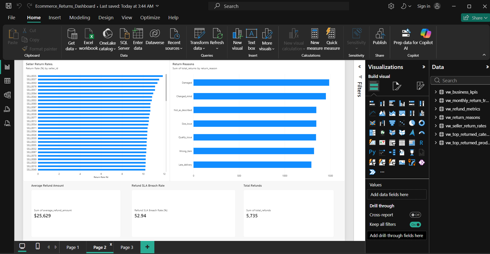

# E-commerce Returns & Refunds Data Engineering Pipeline

An end-to-end data engineering project that processes e-commerce orders, returns, and refunds to generate reliable business insights.

The pipeline ingests raw data from Amazon S3, transforms it using PySpark and Delta Lake in Databricks, applies data quality validation and quarantine handling, creates business-ready Gold tables, and delivers analytics through Power BI.

## Business Problem

E-commerce businesses need to understand why customers return products and how returns affect refunds and operations.

This project answers questions such as:

- What is the overall product return rate?
- Which products and categories have the highest return volumes?
- Which sellers have higher return rates?
- What are the most common return reasons?
- How much money is being refunded?
- How long do refunds take to process?
- How often do refunds breach the expected SLA?

## Architecture

```text
Source CSV Data
      ↓
Amazon S3 (Raw Layer)
      ↓
Bronze Delta Tables
      ↓
Silver Delta Tables
      ↓
Data Quality & Quarantine
      ↓
Gold Fact & Dimension Tables
      ↓
Business Metrics
      ↓
Power BI Dashboard
```

## Technology Stack

- **Python** — synthetic data generation and validation
- **PySpark** — data transformation and processing
- **Databricks** — data engineering and pipeline execution
- **Delta Lake** — reliable storage for Bronze, Silver, and Gold layers
- **Amazon S3** — raw data storage
- **Databricks Workflows** — pipeline orchestration
- **SQL** — business metrics and analytical views
- **Power BI** — business intelligence and visualization
- **GitHub** — version control and project documentation

 
## Pipeline Layers

### Bronze Layer

The Bronze layer ingests raw CSV data from Amazon S3 into Delta tables while preserving the source structure.

### Silver Layer

The Silver layer cleans and standardizes the data, removes duplicates, validates business rules, and separates invalid records into quarantine tables.

### Quarantine Layer

Invalid and duplicate records are retained in dedicated quarantine tables for auditing and investigation instead of being silently discarded.

### Gold Layer

The Gold layer contains business-ready fact and dimension tables used for analytics and reporting.

Key Gold tables include:

- `fact_orders`
- `fact_returns`
- `fact_refunds`
- `dim_customer`
- `dim_product`
- `dim_seller`
- `dim_date`
- `product_return_metrics`
- `seller_return_metrics`
- `monthly_return_metrics`
- `refund_sla_metrics`

## Data Quality

The pipeline includes automated data quality checks to ensure reliable analytical data.

Validation checks include:

- Duplicate key detection
- Null key validation
- Invalid order quantity detection
- Return date validation
- Orphan return detection
- Orphan refund detection
- Negative refund amount detection
- Gold table row-count validation

Invalid records are moved to quarantine tables instead of being silently dropped.

The final Databricks workflow completed successfully across all stages:

`Bronze → Silver → Gold → Data Quality`

## Business Metrics

The Gold layer provides business-ready metrics for the Power BI dashboard, including:

- Total orders
- Total returns
- Return rate
- Total refund amount
- Average refund processing time
- Refund SLA breaches
- Top returned products
- Top returned categories
- Seller return rates
- Monthly return trends
- Return reasons
- Refund rate

## Project Structure

```text
return-and-refunds/
│
├── generate_data.py
├── validate_data.py
├── README.md
│
├── notebooks/
│   ├── 01_bronze_ingestion
│   ├── 02_silver_transformation
│   ├── 03_gold_layer
│   ├── 04_data_quality_testing
│   └── 05_business_metrics
│
└── sql/
```

## Key Engineering Decisions

- **Bronze/Silver/Gold architecture** separates raw ingestion, data transformation, and business-ready analytics.
- **Delta Lake** provides reliable table storage and supports scalable data processing.
- **Quarantine tables** preserve invalid and duplicate records for auditability instead of silently dropping them.
- **Independent fact aggregation** prevents fan-out and double-counting when calculating business KPIs.
- **Automated data quality checks** validate keys, relationships, dates, amounts, and Gold table outputs.
- **Databricks Workflows** orchestrate the pipeline from ingestion through validation.
- **Power BI** consumes Gold/business views rather than raw or intermediate data.

## Project Results

The completed pipeline processes:

- 20,000 customers
- 2,000 products
- 100 sellers
- 99,750 valid orders
- 9,593 valid returns
- 5,735 valid refunds

Key business results include:

- **Return rate:** 9.62%
- **Total refund amount:** $146,981,913
- **Average refund processing time:** 3.34 days
- **Refund SLA breaches:** 3,036
- **Refund SLA breach rate:** 52.94%

The final Databricks workflow successfully completed the full pipeline from Bronze ingestion through Data Quality validation.

## Power BI Dashboard

The Power BI dashboard provides three analytical pages covering:

- Executive KPIs and overall return trends
- Seller return rates, return reasons, and refund metrics
- Detailed return-reason analysis and top returned products



The dashboard is connected to the Gold/business views generated by the Databricks pipeline.

## How to Run

1. Run `generate_data.py` to generate the synthetic e-commerce datasets.
2. Run `validate_data.py` to validate the generated source data.
3. Upload the raw CSV files to Amazon S3.
4. Run the Databricks notebooks in the following order:
   - `01_bronze_ingestion`
   - `02_silver_transformation`
   - `03_gold_layer`
   - `04_data_quality_testing`
   - `05_business_metrics`
5. Connect Power BI to the Gold/business views in Databricks.

The Databricks Workflow can be used to orchestrate the pipeline from Bronze ingestion through Data Quality validation.
